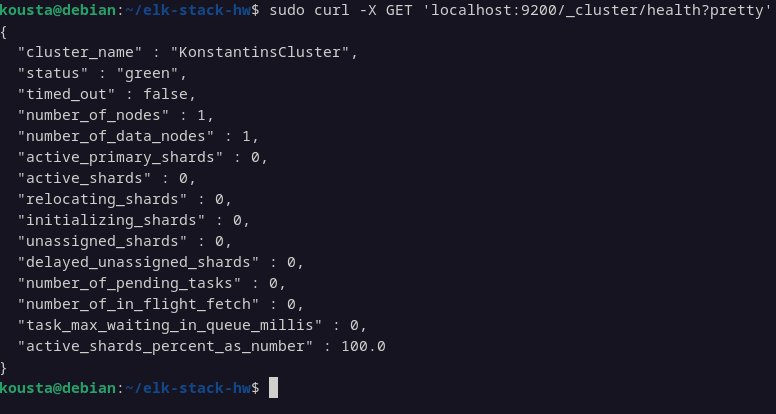
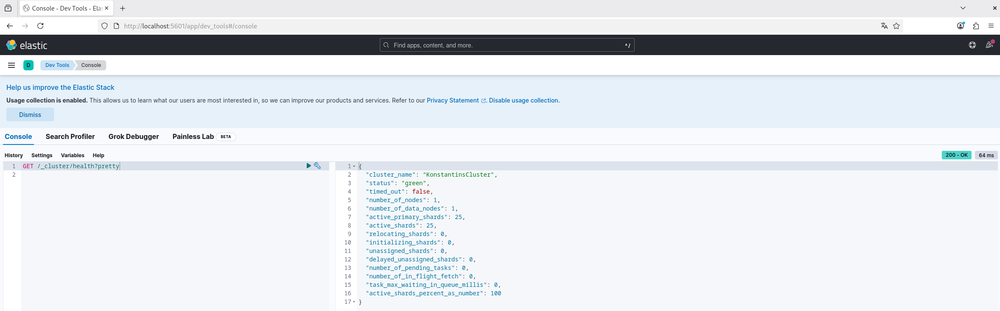
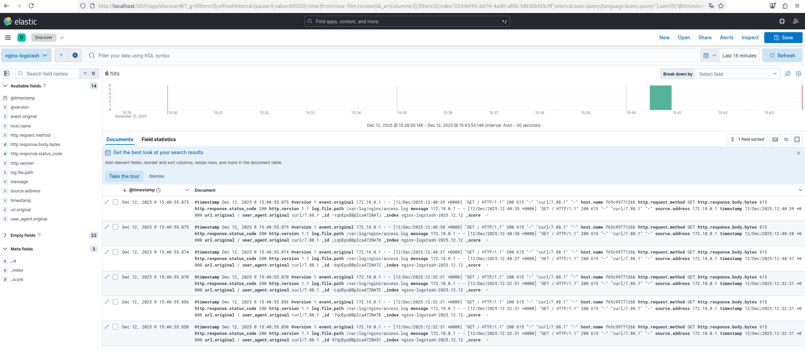
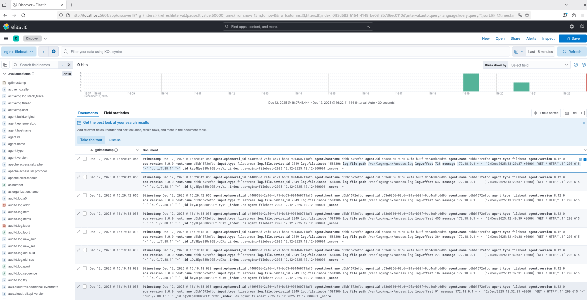

# Домашняя работа: ELK Stack (Elasticsearch, Kibana, Logstash, Filebeat)

## **Задание 1 — Elasticsearch**

Установить и запустить Elasticsearch, изменить параметр `cluster_name` на произвольный.

После запуска выполнить команду:

```bash
curl -X GET 'localhost:9200/_cluster/health?pretty'
```

### 📸 Скриншот 1: **Elasticsearch cluster health**


> На скриншоте отображается состояние кластера Elasticsearch. Поле `cluster_name` подтверждает, что параметр был успешно изменён.

---

## **Задание 2 — Kibana**

Установить и запустить Kibana.
Перейти в интерфейс Dev Tools:

```
http://localhost:5601/app/dev_tools#/console
```

Выполнить запрос:

```
GET /_cluster/health?pretty
```

### 📸 Скриншот 2: **Kibana Dev Tools — cluster health**


> Скрин демонстрирует доступ Kibana к Elasticsearch. Ответ аналогичен выводу curl, что подтверждает корректную работу интерфейса.

---

## **Задание 3 — Logstash + Nginx > Elasticsearch**

Установить Logstash и Nginx. Настроить Logstash так, чтобы он отправлял `access.log` Nginx в Elasticsearch.

После настройки убедиться, что логи появляются в Kibana (раздел Discover).

### 📸 Скриншот 3: **Kibana — логи Nginx, поступившие через Logstash**


> Скрин показывает, что Logstash успешно обрабатывает и отправляет логи Nginx в Elasticsearch.

---

## **Задание 4 — Filebeat → Elasticsearch**

Установить и запустить Filebeat. Переключить отправку логов Nginx с Logstash на Filebeat.

После настройки необходимо проверить, что логи Nginx снова отображаются в Kibana, но уже поступают от Filebeat.

### 📸 Скриншот 4: **Kibana — логи Nginx, поступившие через Filebeat**


> Скриншот подтверждает, что Filebeat успешно считывает логи Nginx и отправляет их напрямую в Elasticsearch, минуя Logstash.
